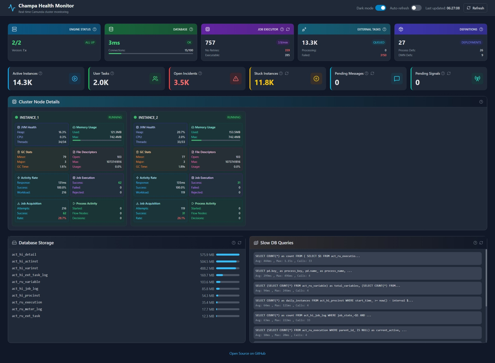
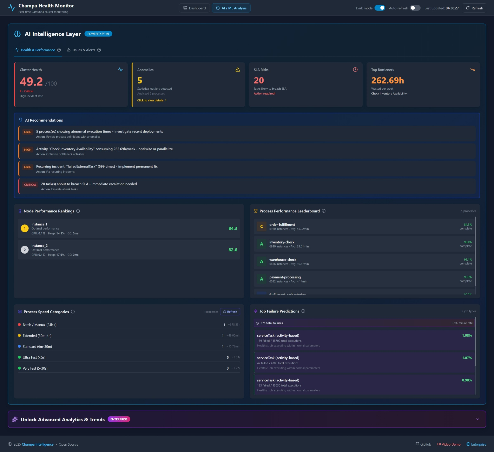
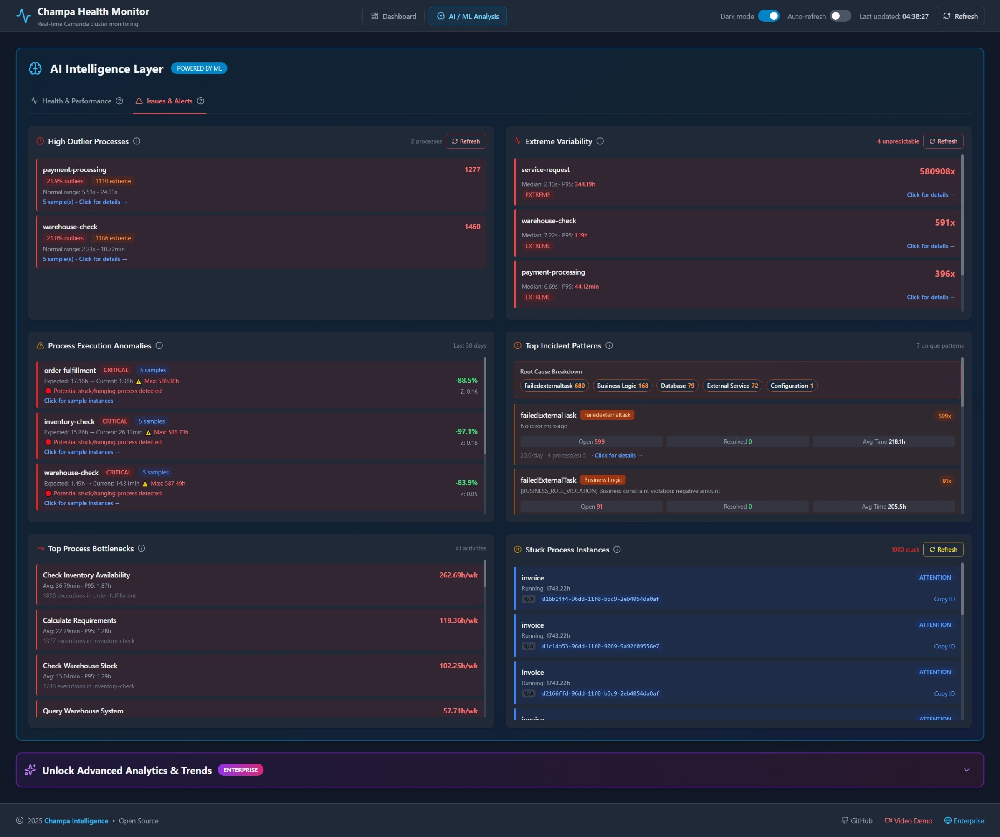
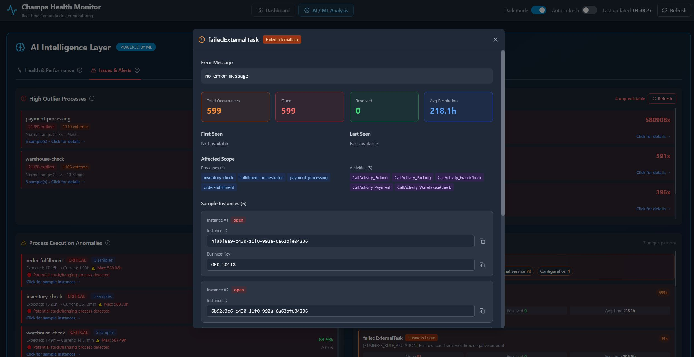
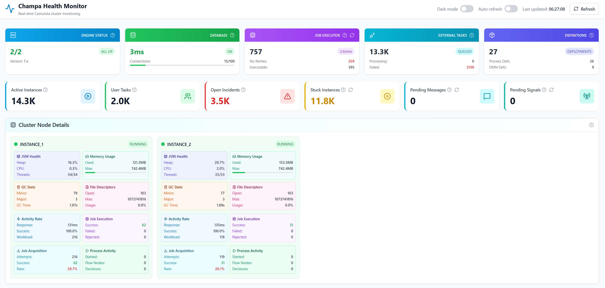
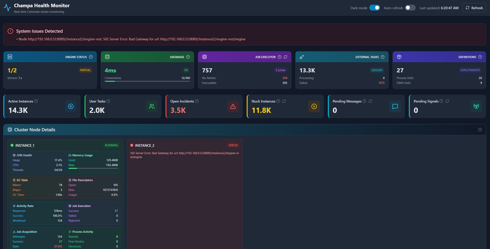

# Camunda Health Monitor & Advanced AI/ML Analytics

A lightweight, real-time monitoring dashboard for Camunda 7 based BPM Platform clusters. Monitor your process engines, track performance metrics, and gain insights into your workflow automation with a modern, responsive interface.


[](https://hub.docker.com/r/champabpmn/camunda-health-monitor) [](https://hub.docker.com/r/champabpmn/camunda-health-monitor)


**✅ Verified Compatible With:**


## 🎥 Video Demo

Watch the feature demonstration on YouTube(enterprise version, but it is 80% the same):

[](https://youtu.be/0FZnLlUSzg8)

[▶️ Watch Demo: Champa Camunda 7 Health Monitor](https://youtu.be/0FZnLlUSzg8)

## 📸 Screenshots

### Full Dashboard View

*Real-time cluster monitoring with comprehensive metrics*


*AI/ML Analysis Health & Performance Tab*


*AI/ML Analysis Issues & Alerts Tab*


*AI/ML Analysis Modal Example*

### Light Theme

*Clean, professional light mode interface*

### Node Status Monitoring

*Immediate visual feedback when nodes become unavailable*

---

## Quick Start with Docker

https://hub.docker.com/r/champabpmn/camunda-health-monitor

1. Create a `.env` file with your configuration (example for Camunda 2 nodes cluster):
```bash
# Database Configuration (PostgreSQL)
DB_NAME=PUT_YOUR_CAMUNDA_DB_NAME_HERE
DB_USER=PUT_YOUR_CAMUNDA_DB_USERNAME_HERE
DB_PASSWORD=PUT_YOUR_CAMUNDA_DB_PASS_HERE
DB_HOST=PUT_YOUR_CAMUNDA_DB_HOSTNAME_OR_IP_ADDRESS_HERE
DB_PORT=5432

# Camunda Node 1 (Required)
CAMUNDA_NODE_1_NAME=node1
CAMUNDA_NODE_1_URL=http://PUT_YOUR_CAMUNDA_BPM_1_NODE_HOST_HERE/engine-rest

# Camunda Node 2 (Optional)
CAMUNDA_NODE_2_NAME=node2
CAMUNDA_NODE_2_URL=http://PUT_YOUR_CAMUNDA_BPM_2_NODE_HOST_HERE/engine-rest

# Camunda Node 3 (Optional)
# CAMUNDA_NODE_3_NAME=node3
# CAMUNDA_NODE_3_URL=http://PUT_YOUR_CAMUNDA_BPM_3_NODE_HOST_HERE/engine-rest

# Camunda API Authentication (if enabled)
CAMUNDA_API_USER=
CAMUNDA_API_PASSWORD=

# Optional: JMX/Micrometer Exporter Endpoints
JMX_NODE_1_URL=http://PUT_YOUR_CAMUNDA_BPM_1_NODE_JVM_METRICS_HOST_HERE/metrics
JMX_NODE_2_URL=http://PUT_YOUR_CAMUNDA_BPM_2_NODE_JVM_METRICS_HOST_HERE/metrics

# JVM Metrics Source: 'jmx' or 'micrometer'(from e.g. Quarkus based installation)
JVM_METRICS_SOURCE=jmx

# Stuck Instance Detection (in days)
STUCK_INSTANCE_DAYS=7

# AI/ML Main Optional Configuration
AI_LOOKBACK_DAYS=30
AI_MAX_INSTANCES=50000
AI_MAX_INCIDENTS=1000
AI_MIN_DATA=10
AI_UI_RESULTS_LIMIT=20
SLA_THRESHOLD_HOURS=24

# Application Settings
PORT=5000
DEBUG=false
JSON_LOGGING=false
SSL_VERIFY=false
```
2. Run in console:
```bash
docker pull champabpmn/camunda-health-monitor:latest
docker run -d -p 5000:5000 --env-file .env champa_bpmn/camunda-health-monitor:latest
```

Access dashboard at http://localhost:5000

In case you Camunda 7 based system does not share JVM metrics - follow easy setup below (JMX Exporter section).

---

## 🌟 Features

### Real-Time Cluster Monitoring
- **Multi-node cluster support** - Monitor all your Camunda nodes from a single dashboard
- **Engine health status** - Track node availability and response times
- **Database connectivity** - Monitor PostgreSQL connection health and latency

### 🤖 Advanced AI/ML Features

**Zero Infrastructure Required** - All AI features use ONLY your existing Camunda database!

#### Machine Learning Capabilities
- **🎯 Smart Stuck Activity Detection** - Statistical P95-based detection (not hardcoded timeouts)
  - Identifies activities taking abnormally long compared to historical patterns
  - Provides Z-scores and severity levels (critical/high/medium)
  - Dynamic thresholds that adapt to your workload

- **📊 Process Duration Prediction** - ML-powered completion time forecasting
  - Random Forest regression trained on historical data
  - Predicts duration based on time-of-day and day-of-week patterns
  - Confidence scores (R²) and percentile distributions (P50, P75, P95)
  - Helps with SLA planning and customer communication

- **📈 Capacity Forecasting** - Future load prediction with time series analysis
  - 30-day forecast of process instance load
  - Growth rate detection and trend confidence
  - Peak hour and busiest day identification
  - Essential for infrastructure and budget planning

- **🔬 Variable Impact Analysis** - Root cause identification
  - Analyzes which process variables correlate with failures
  - Shows impact on failure rates and execution duration
  - Provides actionable recommendations
  - Helps optimize business logic and validation rules

#### Intelligent Analytics
- **Smart Health Score** - AI-powered composite health score (0-100) across 6 dimensions
- **Anomaly Detection** - Dual-logic detection (statistical Z-score + absolute thresholds)
- **Incident Pattern Recognition** - ML clustering of similar errors
- **Process Bottleneck Identification** - Impact analysis (duration × frequency)
- **Job Failure Prediction** - Pattern-based failure risk assessment
- **Node Performance Rankings** - Automated node comparison and scoring
- **Process Performance Leaderboard** - Grade-based rankings (A+ to F)
- **SLA Breach Prediction** - Proactive task escalation alerts

**Business Value:**
- ✅ Prevent issues before they impact users
- ✅ Reduce MTTR with intelligent root cause analysis  
- ✅ Optimize capacity and reduce infrastructure costs
- ✅ Improve SLA compliance with predictive alerts
- ✅ Make data-driven process optimization decisions

### Comprehensive Metrics
- **Process Instances** - Active instances, user tasks, and external tasks
- **Job Execution** - Job executor throughput, failed jobs, and execution rates
- **Incidents** - Real-time incident tracking and error monitoring
- **JVM Metrics** - Heap memory, GC statistics, CPU load, and thread counts (requires JMX Exporter)

### Performance Insights
- **Node-level metrics** - Individual node performance and workload distribution
- **Job acquisition rates** - Success rates and rejection tracking
- **Response time tracking** - Node latency monitoring
- **Database analytics** - Storage usage, slow queries, and archivable instances

### Modern UI
- **Dark mode support** - Easy on the eyes for long monitoring sessions
- **Responsive design** - Works on desktop, tablet, and mobile
- **Auto-refresh** - Configurable automatic data refresh
- **Lazy loading** - Fast initial load with on-demand data fetching

## 📋 Prerequisites

- Python 3.8 or higher
- PostgreSQL database (Camunda's backend)
- Camunda 7.x running with REST API enabled
- JMX Exporter or Micrometer based metrics API for advanced JVM metrics

## Installation

### 1. Install

```bash
git clone https://github.com/bibacrm/camunda-health-monitor.git
cd camunda-health-monitor
pip install -r requirements.txt
```

### 2. Configure

Create `.env` file (example for Camunda 2 nodes cluster):

```env
# Database Configuration (PostgreSQL)
DB_NAME=PUT_YOUR_CAMUNDA_DB_NAME_HERE
DB_USER=PUT_YOUR_CAMUNDA_DB_USERNAME_HERE
DB_PASSWORD=PUT_YOUR_CAMUNDA_DB_PASS_HERE
DB_HOST=PUT_YOUR_CAMUNDA_DB_HOSTNAME_OR_IP_ADDRESS_HERE
DB_PORT=5432

# Camunda Node 1 (Required)
CAMUNDA_NODE_1_NAME=node1
CAMUNDA_NODE_1_URL=http://PUT_YOUR_CAMUNDA_BPM_1_NODE_HOST_HERE/engine-rest

# Camunda Node 2 (Optional)
CAMUNDA_NODE_2_NAME=node2
CAMUNDA_NODE_2_URL=http://PUT_YOUR_CAMUNDA_BPM_2_NODE_HOST_HERE/engine-rest

# Camunda Node 3 (Optional)
# CAMUNDA_NODE_3_NAME=node3
# CAMUNDA_NODE_3_URL=http://PUT_YOUR_CAMUNDA_BPM_3_NODE_HOST_HERE/engine-rest

# Camunda API Authentication (if enabled)
CAMUNDA_API_USER=
CAMUNDA_API_PASSWORD=

# JMX/Micrometer Exporter Endpoints
JMX_NODE_1_URL=http://PUT_YOUR_CAMUNDA_BPM_1_NODE_JVM_METRICS_HOST_HERE/metrics
JMX_NODE_2_URL=http://PUT_YOUR_CAMUNDA_BPM_2_NODE_JVM_METRICS_HOST_HERE/metrics

# JVM Metrics Source: 'jmx' or 'micrometer'(from e.g. Quarkus based installation)
JVM_METRICS_SOURCE=jmx

STUCK_INSTANCE_DAYS=7

# AI/ML Main Optional Configuration
AI_LOOKBACK_DAYS=30         # Analysis window for all AI features (default: 30)
AI_MAX_INSTANCES=50000      # Max instances to query (default: 50000)
AI_MAX_INCIDENTS=1000       # Max incidents to query (default: 1000)
AI_MIN_DATA=10              # Min data points for analysis (default: 10)
AI_UI_RESULTS_LIMIT=20      # Max results to display (default: 20)
SLA_THRESHOLD_HOURS=24      # SLA threshold for predictions (default: 24)

# Application Settings
PORT=5000
DEBUG=false
JSON_LOGGING=false
SSL_VERIFY=false
```

### 3. Run

```bash
# Development
python app.py

# Production
gunicorn -c gunicorn.conf.py app:app
```

Access at `http://localhost:5000`

## Docker

```bash
# Using Docker Compose (recommended)
docker-compose up -d

# Or build directly
docker build -t camunda-health-monitor .
docker run -p 5000:5000 --env-file .env camunda-health-monitor
```

## Kubernetes

```bash
kubectl apply -f kubernetes-deployment.yaml
```

Edit ConfigMap and Secrets in `kubernetes-deployment.yaml` for your environment.

---

## JMX Exporter

In case your Camunda 7 based system does not share JVM metrics - one of simple solutions is to add JMX exporter (https://github.com/prometheus/jmx_exporter/releases)
add it in related folder together with a small config file (e.g. prometheus-jmx.yml):
```bash
---
startDelaySeconds: 0
ssl: false
lowercaseOutputName: true
lowercaseOutputLabelNames: true
rules:
# --- JVM Metrics ---
- pattern: "java.lang<type=OperatingSystem><>(\\w+)"
  name: "jvm_os_$1"
- pattern: "java.lang<type=Memory><>(\\w+)"
  name: "jvm_memory_$1"
- pattern: "java.lang<type=Threading><>(\\w+)"
  name: "jvm_threading_$1"
- pattern: "java.lang<type=GarbageCollector, name=(.+)><>(\\w+)"
  name: "jvm_gc_$2"
  labels:
    collector: "$1"

```
Start your Camunda 7 based system with adding arguments in JAVA_OPTS or CATALINA_OPTS as:
```bash
-javaagent:/camunda/javaagent/jmx_prometheus_javaagent.jar=9404:/camunda/javaagent/prometheus-jmx.yml

```
Now you can get JVM metrics via <CAMUNDA_HOST>:9404/metrics endpoint.

### Easier setup

Some well known Camunda 7 fork systems (e.g. Operaton, CIB Seven, eximeeBPMS) may already include JMX Exporter, so there is a need to activate it via setting related environment variable:
```bash
JMX_PROMETHEUS=true
```
and just add configuration file in /javaagent/ folder inside project folder, there is no need to extend JAVA_OPTS or CATALINA_OPTS. The path to config file has to look like one of:
 ```bash
/camunda/javaagent/prometheus-jmx.yml
/eximeebpms/javaagent/prometheus-jmx.yml
/operaton/javaagent/prometheus-jmx.yml
```
---

## Architecture

**📚 Detailed architecture:** [PROJECT_STRUCTURE.md](PROJECT_STRUCTURE.md)

## Production Deployment

**Gunicorn** (recommended):
```bash
gunicorn -c gunicorn.conf.py app:app
```

**Configuration** in `gunicorn.conf.py`:
- Workers: CPU cores × 2 + 1
- Timeout: 120s
- Graceful shutdown: 30s

**Database Pool**:
- Min connections: 1
- Max connections: 20
- Timeout: 5s

## Monitoring

**Prometheus**:
```yaml
scrape_configs:
  - job_name: 'camunda-monitor'
    static_configs:
      - targets: ['localhost:5000']
    metrics_path: '/metrics'
```

**Kubernetes Probes**:
- Startup: `/health/startup` (max 150s)
- Liveness: `/health/live` (every 10s)
- Readiness: `/health/ready` (every 5s)

## 📈 Metrics Overview

### Cluster Status
- Total nodes and running nodes
- Engine version information
- System health alerts

### Database Health
- Connection latency
- Active connections
- Connection pool utilization
- Storage usage by table
- Slow query analysis

### Process Metrics
- Active process instances
- User tasks waiting
- External tasks in queue
- Open incidents
- Stuck instances (configurable threshold)
- Pending messages and signals

### Job Executor
- Total jobs in queue
- Job execution throughput (jobs/min)
- Failed jobs (no retries left)
- Executable jobs ready to run

### Node-Specific Metrics
- Response times
- Job acquisition rates
- Execution success rates
- Workload distribution
- JVM health (heap, GC, threads, CPU)

## 🎨 UI Features

### Dark Mode
Toggle between light and dark themes for comfortable monitoring in any environment.

### Auto-Refresh
Enable automatic refresh to keep metrics up-to-date (default: 30 seconds).

### Mobile-Friendly
Responsive design ensures full functionality on desktop, tablet, and mobile devices.

### Lazy Loading
Individual metric cards load on-demand for faster initial page load.

## 📋 API Documentation

### Interactive API Explorer

Access the interactive Swagger UI documentation at:
```
http://localhost:5000/api/docs
```

### Key API Endpoints

#### Health & Monitoring
- `GET /api/health` - Comprehensive cluster health status
- `GET /health` - Basic health check
- `GET /health/live` - Kubernetes liveness probe
- `GET /health/ready` - Kubernetes readiness probe

#### Metrics
- `GET /api/metrics/stuck-instances` - Stuck process instances
- `GET /api/metrics/pending-messages` - Pending message subscriptions  
- `GET /api/metrics/pending-signals` - Pending signal subscriptions
- `GET /api/metrics/job-throughput` - Job execution throughput
- `GET /api/metrics/database` - Database performance metrics

#### AI/ML Analytics
- `GET /api/ai/health-score` - AI-powered cluster health score (0-100)
- `GET /api/ai/anomalies` - Process execution anomaly detection
- `GET /api/ai/incident-patterns` - Incident pattern analysis
- `GET /api/ai/bottlenecks` - Process bottleneck identification
- `GET /api/ai/job-predictions` - Job failure predictions
- `GET /api/ai/node-performance` - Node performance rankings
- `GET /api/ai/process-leaderboard` - Process performance leaderboard
- `GET /api/ai/sla-predictions` - SLA breach predictions
- `GET /api/ai/insights` - Comprehensive AI insights (all-in-one)
- `GET /api/ai/stuck-activities-smart` - Smart stuck activity detection (P95-based)
- `GET /api/ai/predict-duration/{process_def_key}` - ML-powered duration prediction
- `GET /api/ai/capacity-forecast` - Future capacity forecasting
- `GET /api/ai/variable-impact/{process_def_key}` - Variable impact analysis

#### Prometheus Export
- `GET /metrics` - All metrics in Prometheus format (includes AI metrics)

**Note:** All AI endpoints use only existing Camunda database tables (ACT_HI_* and ACT_RU_*). No additional infrastructure required.

---

## 🔒 Security Considerations

This is a monitoring tool that requires read access to:
- Camunda REST API endpoints
- PostgreSQL database

**Important Security Practices:**

- Use read-only database credentials when possible
- Enable authentication on Camunda REST API in production
- Run behind a reverse proxy with HTTPS in production
- Consider network segmentation for database access
- Use environment variables for all sensitive configuration
- Never commit `.env` files to version control

## 🤝 Contributing

Contributions are welcome! Please see [CONTRIBUTING.md](CONTRIBUTING.md) for guidelines.

1. Fork the repository
2. Create your feature branch (`git checkout -b feature/AmazingFeature`)
3. Commit your changes (`git commit -m 'Add some AmazingFeature'`)
4. Push to the branch (`git push origin feature/AmazingFeature`)
5. Open a Pull Request

## 📄 License

This project is licensed under the Apache License 2.0 - see [LICENSE.md](LICENSE.md) for details.

**Voluntary Support**: While this software is free and open source, voluntary contributions help maintain and improve this project. See [LICENSING_FAQ.md](LICENSING_FAQ.md) and [LICENSE.md](LICENSE.md) for more information about supporting the project.

## 🙏 Acknowledgments

- Built for the [Camunda 7 BPM Platform](https://camunda.com/platform/camunda-bpm/)
- UI powered by [Alpine.js](https://alpinejs.dev/) and [Tailwind CSS](https://tailwindcss.com/)
- Icons by [Lucide](https://lucide.dev/)

## 📞 Support & Contact

- **Issues**: [GitHub Issues](https://github.com/bibacrm/camunda-health-monitor/issues)
- **Enterprise Solutions**: [Champa Intelligence](https://champa-bpmn.com)
- **Email**: info@champa-bpmn.com

---

**Developed by [Champa Intelligence](https://champa-bpmn.com)** - Enterprise BPM Solutions

For advanced features, professional support, and enterprise deployments, visit [champa-bpmn.com](https://champa-bpmn.com).
